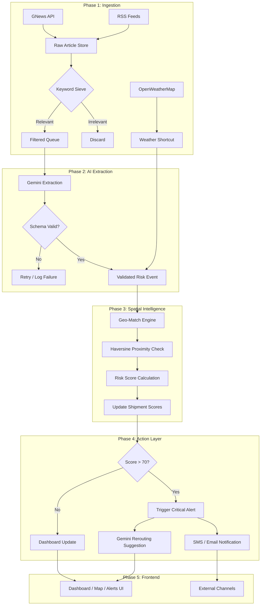

# 🛠️ RouteGuard: Implementation Strategy & Roadmap

> **A phased blueprint for building an AI-powered logistics intelligence platform — from interactive prototype to production-grade decision engine.**

This document defines the complete development roadmap for RouteGuard, organized into sequential phases. Each phase builds upon the previous one, ensuring that every milestone delivers a demonstrable, testable increment of the system. The architecture prioritizes **Gemini-driven intelligence**, **real-time geospatial awareness**, and **actionable decision support** for global supply chain operations.

---

## 📍 Current State Assessment

Before diving into the phases, here is a snapshot of where the project stands today:

| Layer | Status | Details |
| :--- | :---: | :--- |
| **Frontend (React + Vite)** | ✅ Complete | Dashboard, Interactive Map (Leaflet), What-If Simulator, Alerts Panel — all functional with Tailwind CSS styling. |
| **Mock Data Layer** | ✅ Complete | 10 shipments with realistic coordinates, 3 risk events (Typhoon, Strike, Congestion), 5 alerts with severity scores. |
| **Component Architecture** | ✅ Complete | Modular components: `Header`, `Sidebar`, `Layout`, `MapComponent`, `MultiMapComponent`. Pages: `Dashboard`, `MapPage`, `SimulatorPage`, `AlertsPage`. |
| **Backend / API Layer** | ❌ Not Started | No server, no database, no external API connections. |
| **Gemini AI Integration** | ❌ Not Started | No AI extraction pipeline exists. |
| **Real-Time Data Feeds** | ❌ Not Started | All data is currently hardcoded in `shipments.js`. |

---

## 🟢 Phase 1 — Foundation & Signal Ingestion Layer

> **Objective**: Stand up the backend server and connect the first real-world data sources, replacing static mock data with a live signal feed.

### 1.1 Backend Server Initialization

Set up a lightweight backend service that will serve as the central nervous system for all data processing. This server will expose REST API endpoints that the existing React frontend can consume, replacing the hardcoded `shipments.js` imports.

- **Technology**: Node.js (Express) or Python (FastAPI) — chosen for rapid prototyping and native async support.
- **Core Endpoints**:
  - `GET /api/shipments` — Returns all active shipments with their current risk scores.
  - `GET /api/events` — Returns all detected risk events (initially from mock data, then from live feeds).
  - `GET /api/alerts` — Returns all active alerts tied to shipments and events.
- **Database**: Firebase Firestore or a lightweight SQLite instance to persist events, shipments, and alert history across sessions. The schema mirrors the existing `initialShipments`, `initialAlerts`, and `initialRiskEvents` data structures.

### 1.2 Data Source Connectors

Build modular "connector" functions — each responsible for fetching raw signals from a single external source. Connectors are designed to be stateless and idempotent so they can be triggered on a schedule (e.g., every 15 minutes via a cron job or Cloud Scheduler).

| Connector | Source | Data Type | Priority |
| :--- | :--- | :--- | :---: |
| **News Connector** | GNews API | Unstructured text (headlines, descriptions) | 🔴 Critical |
| **RSS Connector** | Reuters / Logistics RSS Feeds | Unstructured text (articles, bulletins) | 🟡 High |
| **Weather Connector** | OpenWeatherMap Alerts API | Structured JSON (lat, lng, severity, type) | 🟡 High |

### 1.3 The Relevance Filter (Keyword Sieve)

Before any raw signal is sent to the AI extraction engine (Phase 2), it must pass through a **lightweight keyword filter**. This is a critical cost-saving measure that eliminates irrelevant articles *before* they consume Gemini API tokens.

```python
LOGISTICS_KEYWORDS = [
    "port", "strike", "shipping", "supply chain", "typhoon",
    "hurricane", "storm", "flood", "congestion", "blockage",
    "embargo", "sanctions", "rail disruption", "freight", "cargo",
    "vessel", "container", "terminal", "customs", "piracy"
]

def is_relevant(article: dict) -> bool:
    """Pre-screen articles before sending to Gemini. Reduces AI calls by ~70-80%."""
    text = (article.get("title", "") + " " + article.get("description", "")).lower()
    return any(keyword in text for keyword in LOGISTICS_KEYWORDS)
```

**Expected Impact**: Reduces Gemini API calls by **70–80%**, keeping the system fast and cost-effective even at high ingestion volumes.

### 1.4 Deduplication Logic

Multiple sources often report the same event. Before storing or processing a signal, the system performs a deduplication check using a combination of **title similarity** (fuzzy matching) and **geospatial proximity** (events within 50km of each other within the same 6-hour window are flagged as duplicates).

### Phase 1 Deliverables

- [ ] Backend server running with REST endpoints serving data to the React frontend.
- [ ] At least one live data connector (GNews) fetching and storing raw articles.
- [ ] Keyword sieve filtering irrelevant articles before AI processing.
- [ ] Frontend updated to fetch data from API instead of hardcoded `shipments.js`.

---

## 🟣 Phase 2 — The Heart: Gemini AI Extraction Engine

> **Objective**: Transform messy, unstructured text from news articles and RSS feeds into precise, structured JSON risk objects using Google Gemini — the core innovation of RouteGuard.

### 2.1 Prompt Engineering

The quality of the entire system depends on the Gemini prompt. The prompt must instruct Gemini to act as a **supply chain risk analyst**, extracting specific, structured fields from raw article text. The prompt enforces strict JSON output to ensure downstream systems can consume results without parsing failures.

**Gemini Prompt Template:**
```
You are a supply chain risk analyst. Given the following news article,
extract a structured risk assessment. If the article is NOT relevant to
logistics, shipping, or supply chain disruption, return {"relevant": false}.

Otherwise, return a JSON object with:
- "location": The primary affected location (port, city, or region).
- "lat": Latitude of the affected location (float).
- "lng": Longitude of the affected location (float).
- "risk_type": One of ["weather", "port_strike", "political", "congestion",
  "piracy", "infrastructure", "customs", "environmental"].
- "severity": Integer from 1 (minor) to 5 (catastrophic).
- "summary": A 1-2 sentence operational impact summary for a logistics manager.
- "estimated_duration_hours": Estimated duration of the disruption.
- "source_confidence": One of ["high", "medium", "low"].

Article:
{article_text}
```

### 2.2 Output Validation Layer

AI outputs are inherently non-deterministic. Every Gemini response is validated against a strict schema before it enters the database. This prevents malformed data from crashing the Geo-Matching engine or corrupting the risk score calculations.

- **Schema Validation**: Use Zod (JavaScript) or Pydantic (Python) to enforce type safety on every field.
- **Coordinate Bounds Check**: Reject any response where `lat` is outside `[-90, 90]` or `lng` is outside `[-180, 180]`.
- **Severity Range Check**: Reject any response where `severity` is not an integer between 1 and 5.
- **Fallback**: If validation fails after retry, the raw article is logged to a `failed_extractions` table for manual review.

### 2.3 Retry & Resilience Mechanism

Gemini API calls can fail due to rate limits, network issues, or malformed outputs. The extraction engine implements an **exponential backoff retry strategy**:

1. **Attempt 1**: Immediate call.
2. **Attempt 2**: Wait 2 seconds, retry with a slightly rephrased prompt.
3. **Attempt 3**: Wait 5 seconds, retry with a simplified prompt requesting only `location`, `lat`, `lng`, and `severity`.
4. **Failure**: Log the article to `failed_extractions` and move on. Never block the pipeline.

### 2.4 The "Weather Shortcut"

Weather alerts from OpenWeatherMap are **already structured** — they arrive with `lat`, `lng`, `severity`, and `area` fields. These bypass Gemini entirely and are converted directly into risk objects:

```python
def weather_to_risk_event(alert: dict) -> dict:
    """Weather alerts skip Gemini — they're already structured."""
    return {
        "location": alert["area"],
        "lat": alert["lat"],
        "lng": alert["lon"],
        "risk_type": "weather",
        "severity": map_weather_severity(alert["level"]),
        "summary": alert["description"],
        "source": "OpenWeatherMap",
        "source_confidence": "high",
    }
```

This adds immediate credibility and low-latency risk detection to the platform without consuming AI tokens.

### Phase 2 Deliverables

- [ ] Gemini extraction pipeline processing filtered articles into structured JSON.
- [ ] Schema validation rejecting malformed AI outputs with logging.
- [ ] Retry mechanism with exponential backoff for transient failures.
- [ ] Weather alerts flowing directly into the risk events table (no AI needed).
- [ ] All extracted events stored in the database with source attribution.

---

## 🟠 Phase 3 — Spatial Intelligence: Geo-Matching & Risk Scoring

> **Objective**: Answer the critical question — *"Does this event affect MY shipments?"* — by calculating geospatial proximity between risk events and active shipment routes, then computing a dynamic risk score.

### 3.1 Geo-Fencing & Proximity Matching

Once a risk event has been extracted and validated, the **Geo-Matching Engine** determines which (if any) active shipments are affected. This is the "Spatial Brain" of RouteGuard.

**Algorithm:**
1. For each new risk event, retrieve its `(lat, lng)` coordinates.
2. For each active shipment, iterate over all **waypoints** in its route polyline (the `coords` array).
3. Calculate the **Haversine distance** between the event and each waypoint.
4. If any waypoint falls within a configurable **Critical Radius** (default: 200km), the shipment is flagged as "affected."

```python
from math import radians, sin, cos, sqrt, atan2

def haversine(lat1, lng1, lat2, lng2) -> float:
    """Returns distance in kilometers between two (lat, lng) points."""
    R = 6371  # Earth's radius in km
    dlat, dlng = radians(lat2 - lat1), radians(lng2 - lng1)
    a = sin(dlat/2)**2 + cos(radians(lat1)) * cos(radians(lat2)) * sin(dlng/2)**2
    return R * 2 * atan2(sqrt(a), sqrt(1 - a))

def is_shipment_affected(event, shipment, radius_km=200) -> bool:
    """Check if any waypoint of a shipment is within the event's critical radius."""
    for waypoint in shipment["coords"]:
        if haversine(event["lat"], event["lng"], waypoint[0], waypoint[1]) < radius_km:
            return True
    return False
```

### 3.2 Dynamic Risk Scoring Algorithm

Once a shipment is matched to one or more risk events, a composite **Risk Score** (0–100) is calculated. This score drives the entire decision layer — determining alert severity, UI color coding, and whether autonomous rerouting is triggered.

**Formula:**
```
Risk Score = min(100, Σ (Severity × Weight × Proximity_Factor × Freshness_Factor))
```

| Factor | Description | Range |
| :--- | :--- | :--- |
| **Severity** | From Gemini extraction (1–5 scale, normalized to 0–20) | 0–20 |
| **Weight** | Event type multiplier (e.g., `piracy: 1.5`, `weather: 1.0`, `congestion: 0.8`) | 0.5–2.0 |
| **Proximity Factor** | Inverse of distance: `max(0, 1 - (distance_km / radius_km))` | 0.0–1.0 |
| **Freshness Factor** | Temporal decay: `max(0, 1 - (hours_since_event / 72))`. Events older than 72h contribute nothing. | 0.0–1.0 |

**Design Decision**: Multiple events affecting the same shipment are **additive** — a typhoon AND a port strike near the same route compound the risk, pushing the score higher. This reflects real-world logistics reality where compound disruptions are disproportionately damaging.

### 3.3 Unified Risk Architecture

Two fundamentally different data streams converge into a single `risk_events` table:

1. **AI-Based (Stochastic)**: News Article → Keyword Filter → Gemini Extraction → Validated Risk Object.
2. **Structured (Deterministic)**: Weather/Port API → Direct JSON Mapping → Risk Object.

Both feed the same database table. The UI, Scoring Engine, and Alerting System read from this unified source — they never need to know *how* the risk was detected, only *what* the risk is.

### Phase 3 Deliverables

- [ ] Haversine-based geo-matching engine linking events to shipments.
- [ ] Dynamic risk scoring with severity, proximity, and temporal decay.
- [ ] Compound risk accumulation for shipments affected by multiple events.
- [ ] Real-time score updates reflected on the Dashboard and Map.

---

## 🔴 Phase 4 — Actionable Intelligence: Alerts, Rerouting & Decision Support

> **Objective**: Move beyond passive monitoring. RouteGuard doesn't just show risk — it tells you **what to do next**. This phase implements the autonomous alert system, AI-powered rerouting suggestions, and the "What-If" simulation engine.

### 4.1 Tiered Alert System

Alerts are triggered based on risk score thresholds and delivered through appropriate channels based on urgency:

| Risk Score | Tier | UI Treatment | External Action |
| :---: | :--- | :--- | :--- |
| **0–39** | 🟢 Low | Green indicator, info-level log | None |
| **40–69** | 🟡 Medium | Amber indicator, card in Alerts Panel | Optional email digest |
| **70–100** | 🔴 High / Critical | Red indicator, full-screen toast, pulsing map marker | **Immediate** SMS/Email to logistics manager |

- **Alert Deduplication**: An alert is only generated once per `(shipment_id, event_id)` pair. Resolved alerts can be re-triggered if the event's severity escalates.
- **Alert Lifecycle**: `ACTIVE` → `ACKNOWLEDGED` → `RESOLVED`. Each state transition is timestamped for audit trails.

### 4.2 Gemini-Powered Rerouting Suggestions

When a High Risk alert is triggered, RouteGuard uses Gemini to generate **operational rerouting suggestions** — not just data, but the *next best action*.

**Rerouting Prompt:**
```
You are a maritime logistics advisor. A shipment traveling from {origin} to
{destination} via the following waypoints: {waypoints} is affected by:
{event_summary} at coordinates ({lat}, {lng}).

Suggest 2-3 alternative routing options. For each, provide:
- "route_name": A human-readable route description.
- "estimated_delay_hours": Additional time compared to the original route.
- "estimated_cost_increase_percent": Additional cost as a percentage.
- "risk_reduction": How much the risk score is expected to drop (0-100).
- "reasoning": Why this route avoids the disruption.
```

These suggestions are displayed in the **Intelligence Panel** alongside the alert, giving logistics managers instant, actionable options.

### 4.3 "What-If" Simulation Engine

The existing `SimulatorPage` frontend component is upgraded to connect to the backend scoring engine. Users can:

1. **Place a virtual risk event** on the map (click to set location, select type and severity).
2. **Trigger the full pipeline**: The simulated event runs through Geo-Matching and Risk Scoring in real-time.
3. **Observe the cascade**: Watch which shipments' risk scores spike, which alerts would fire, and what rerouting options Gemini suggests.
4. **Reset**: Clear the simulation and return to live data.

This transforms the Simulator from a visual demo into a genuine **supply chain stress-testing tool**.

### Phase 4 Deliverables

- [ ] Tiered alert system with SMS/Email delivery for critical risks.
- [ ] Gemini-generated rerouting suggestions displayed in the Intelligence Panel.
- [ ] What-If Simulator connected to the live scoring engine.
- [ ] Alert lifecycle management (Active → Acknowledged → Resolved).

---

## 🔵 Phase 5 — Production Polish, Demo Strategy & Deployment

> **Objective**: Harden the system for reliability, optimize for cost, and prepare an airtight demo that guarantees an instant "WOW" response during judging.

### 5.1 Rate Limiting & Cost Optimization

- **API Call Budgeting**: Implement a daily token budget for Gemini API calls. Once the budget is 80% consumed, switch to a "headlines-only" extraction mode (shorter prompts, lower token cost).
- **Response Caching**: Cache Gemini responses keyed by article URL hash. If the same article is re-ingested (e.g., from multiple RSS feeds), the cached extraction is used.
- **Batch Processing**: For production scale, batch 3-5 articles into a single Gemini call to reduce overhead while maintaining accuracy.

### 5.2 Critical UX "Small Touches"

These micro-details transform the prototype into something that *feels* production-grade:

| Touch | Implementation | Impact |
| :--- | :--- | :--- |
| **Source Attribution** | Every risk event card displays its origin (e.g., "via Reuters", "via OpenWeatherMap") | Builds trust and credibility |
| **Freshness Indicator** | "Detected 5 mins ago" with a relative timestamp that auto-updates | Creates urgency and real-time feel |
| **Risk Color Palette** | Strict `🔴 Red` (>70), `🟡 Amber` (40-69), `🟢 Green` (<40) applied universally | Instant visual comprehension |
| **Loading Skeletons** | Shimmer effects while data loads instead of blank screens | Professional, polished UX |
| **Micro-Animations** | Subtle pulse on new alerts, smooth score transitions, map marker bounces | Alive, dynamic interface |

### 5.3 The "Golden Scenarios" Demo Strategy

To guarantee an impactful demo regardless of live data availability, pre-load the database with high-impact, historically accurate scenarios that demonstrate every capability of the system:

| Scenario | Type | What It Demonstrates |
| :--- | :--- | :--- |
| **Suez Canal Blockage (Ever Given)** | Infrastructure | Global shipment delays, Cape of Good Hope rerouting, compound risk on multiple vessels. |
| **Shanghai COVID Shutdown** | Congestion | Port lead-time spikes, container backlog cascading to downstream ports. |
| **Red Sea / Houthi Crisis** | Political / Piracy | High-severity security alerts, immediate rerouting, Gemini operational advisories. |

**Strategy**: Pre-store these events in the database and run the full pipeline (Geo-Match → Score → Alert → Reroute) on startup. This guarantees the judges see a **rich, active, populated dashboard** from the very first second — never an empty map.

### 5.4 Deployment & CI/CD

- **Frontend**: Deploy to Firebase Hosting or Vercel for instant, global CDN distribution.
- **Backend**: Deploy to Google Cloud Run for serverless, auto-scaling API endpoints.
- **Scheduled Jobs**: Use Google Cloud Scheduler to trigger the ingestion pipeline every 15 minutes.
- **Monitoring**: Basic health checks and error logging via Cloud Logging.

### Phase 5 Deliverables

- [ ] API cost optimization (caching, budgeting, batch processing).
- [ ] UX polish (source attribution, freshness, loading states, animations).
- [ ] Golden Scenarios pre-loaded for bulletproof demo.
- [ ] Deployed to cloud with automated ingestion schedule.

---

## 🚨 Execution Guardrails (What to Avoid at All Costs)

These are hard constraints that the team must enforce throughout all phases:

> [!CAUTION]
> **❌ API Bloat**: Stick to GNews, RSS, and OpenWeatherMap. Do not waste sprint time integrating niche connectors that add complexity without proportional demo value.

> [!CAUTION]
> **❌ Over-Engineering AI**: No Vector Databases, no fine-tuning, no embeddings pipelines. A well-crafted Gemini prompt with strict JSON output is the superior tool for this use case. Keep it simple.

> [!CAUTION]
> **❌ The "Empty Map" Anti-Pattern**: The demo must NEVER launch to a blank dashboard. Pre-seeded Golden Scenarios and mock shipments ensure immediate visual density and interactivity from the first frame.

> [!WARNING]
> **❌ Premature Optimization**: Do not build caching, rate limiting, or batch processing until the core pipeline (Ingest → Extract → Match → Score → Alert) works end-to-end. Get it working, then make it fast.

---

## 📊 Full Pipeline Architecture (All Phases Combined)



---

*Last Updated: April 2026 | Team Nonchalants*
